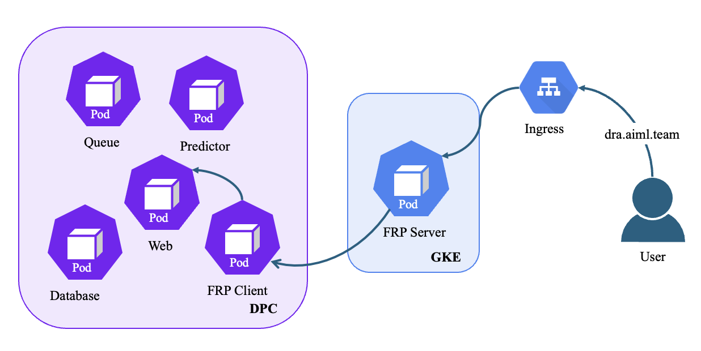

# Application Deployment

This document provides detailed instructions for deploying the Anomaly detection tool to a production environment using application services on a Deep Purple Cluster (DPC) and Fast Reverse Proxy (FRP) server, with ingress rules configured on Google Kubernetes Engine (GKE).

## Prerequisites

- Access and permissions to manage aiml-dra-anomaly namespace in DPC
- Access and permissions to manage aiml-dra-anomaly namespace in GKE
- The kubectl command-line tool, configured to interact with aiml infrastructure GKE and DPC cluster. You can use the following command to set the context for GKE and DPC.

For GKE

```shell
kubectl config set-context gke_aiml-infrastructure_australia-southeast1-b_aiml-infrastructure-cluster --namespace=aiml-dra-anomaly
```

For DPC

```shell
kubectl config set-context dpc --namespace=aiml-dra-anomaly
```
NOTE: if you have not set the context, the script would not be able to switch between the DPC and GKE contexts. 

## Architecture Overview
This architecture involves several components distributed across a GPC and GKE. The setup leverages various technologies and communication protocols to ensure efficient data handling, processing, and service delivery. The aiml-dra-anomaly namespace in DPC consists of database, queue, web, predictor and frp-client, while the aiml-dra-anomaly namespace in GKE contains FRP-server. The role of each of these services are listed below.

- Database: Postgres database for storing application data.
- Queue: NATS queue for handling application requests and results. This is also used to scale predictor using Keda.
- Web: Serves the application's user interface and handles HTTP requests from clients, interacting with other backend services as needed.
- Predictor: Python application to process the image to determine anomalies.  
- FRP-client: Connects securely to the FRP server on GKE to facilitate access to internal web service from an external network.



As shown in the figure above, external requests are directed to a LoadBalancer Ingress hosted on GKE, serving as the gateway for all external HTTP(S) traffic, which forwards these requests to the FRP Server. This server is configured to securely tunnel incoming traffic to the FRP Client in the DPC cluster using a tunnel established by the FRP framework. The FRP Client maintains this secure connection, allowing it to effectively "port forward" (using kubectl) requests to the private network, where it then redirects them to the web service. THe web service then processes the request and sends the response back through the FRP Client to the FRP Server, which in turn sends it back to the client through the LoadBalancer Ingress.

## Deployment

To deploy the application and set up frp, run the deploy_resources.sh script

```shell
chmod +x deploy_resources.sh
./deploy_resources.sh
```

The script will deploy the following pods:

| Resource | Type | Cluster |
|----------|----------|----------|
| web | Statefulset | DPC |
| predictor | Statefulset | DPC |
| queue | Statefulset | DPC |
| queue-setup | Job | DPC |
| google-sdk-frp-client | Deployment | DPC |
| frp-dra-service | Deployment | GKE |


The application can be accessed at https://dra.aiml.team/.

## Undeploying 

To undeploy the application, run the delete_resources.sh script

```shell
chmod +x delete_resources.sh
./delete_resources.sh
```

All resources should be deleted.
