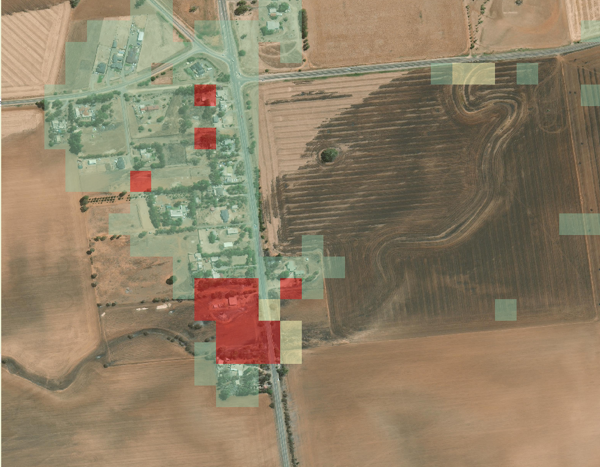
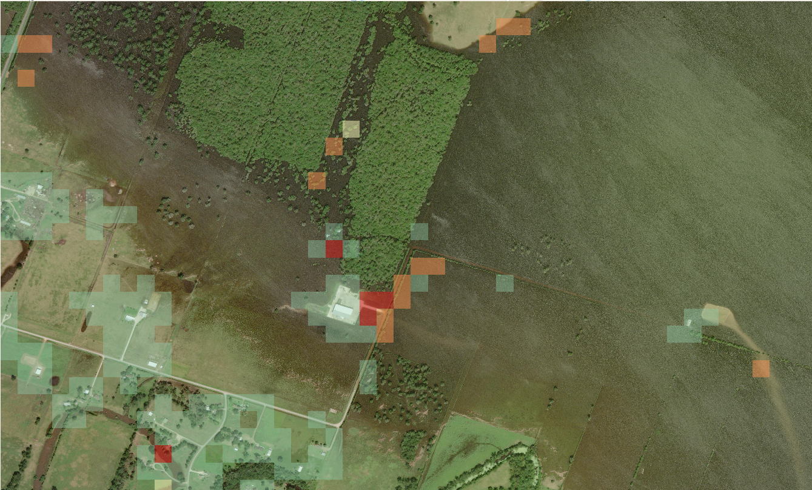

This file shows some example images from GIS triage tool.

**Example 1**: Hurricane  

In this image, red indicates the damaged/affected buildings and houses from floods after a hurricane, green indicates properties that are properties that are unaffected and yellow shows other manmade properties such as roads that has been affected by flood following a hurricane.

**Example 2**: Bushfire (satellite)

In this image, red indicates the fire damaged/affected buildings and houses, green indicates properties that are properties that are unaffected by the bushfire and yellow shows other manmade properties such as roads and gardens that has been affected by the bushfire.

**Example 3**: Bushfire (aerial)

In this image, red indicates the fire damaged/affected buildings, green indicates properties that are properties that are unaffected by the bushfire and yellow shows other vegetation burnt by the bushfire.

**Example 4**: Earthquake

In this image, red indicates collapsed buildings and green indicate manmade properties such as buildings, agricultural fields, roads, etc that are unaffected by the earthquake.

**Example 5**: Tornado

In this image, red indicates damaged buildings and green indicate manmade properties such as buildings and roads that are unaffected by the earthquake. From this image, the path of tornado can be observed from the red diagonal cluster (damaged building). The image below is the same image with different question set  to highlight all the damaged buildings and also the debris. 

**Example 6**: Flood

In this image, red indicates the flood damaged/affected buildings and houses, green indicates properties that are properties that are unaffected by the flood, orange shows other manmade properties such as roads affected by the flood, and yellow shows some vegetation submerged in water.

