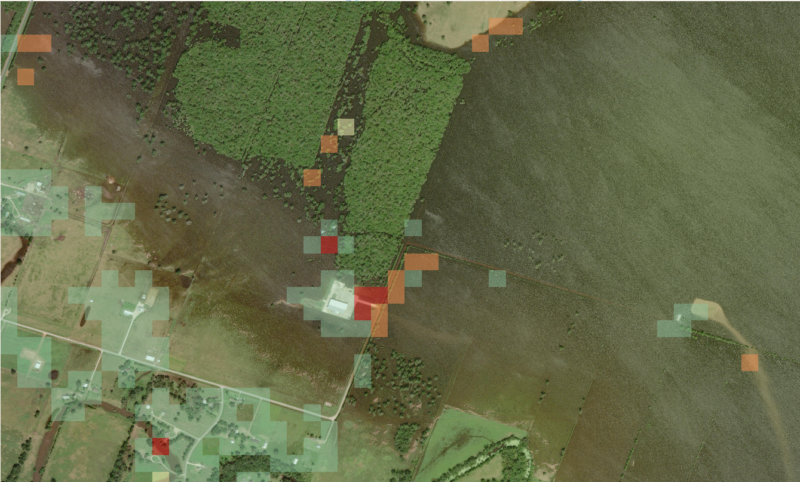

# Observations from Experiments

## Overview
This document states the observations made during the testing of the GIS tool.

## Observations
- The models prediction is dependent on the presence of objects. For example (images shown below), with the image of flood affected area, it fails to detect those areas where there were no submerged objects. Similarly, with bushfire, it failed to detect large areas of agricultural fields which had been burned. 

Increasing the tile size improved the prediction in some instances, however it's performance dropped for identifying objects such as buildings within the image.

- Giving context was found to improve the result. It can be beneficial to concatenate parent question answer pairs for sub questions.
- Several cases of false positives in were observed for identifying damaged man-made properties, however specifying it as a house or building improved the result.
- It was observed that sometimes the scores were not reflected on the result. For example the logs shows that the output was 'yes', for which the score was 1, but the final result shows all tiles having the score of 0. This is caused by generation of invalid result file (dist-0-0.tif). There were also instances where not all (but only one) of the sub-questions were prompted. 
- There were few instances where the model gave a response different to the answer set. For example, for an question looking for a 'yes' or 'no' answer, model may give output like 'no not'. This inturn also affected the final result. 
- Sometimes the context was needed to formulate questions for some images.
- User needs to be careful when formulating the questions with sub-questions. If there is a false prediction, it can prevent the execution of sub-questions. For example with earthquake images, the model failed to determine whether the area was affect by earthquake, which in turn prevented the damages being identified.
- It can sometimes identify construction sites as damaged areas. 
- Processing fails for large images
